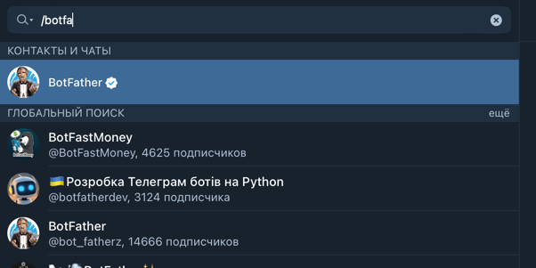
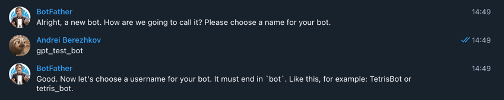
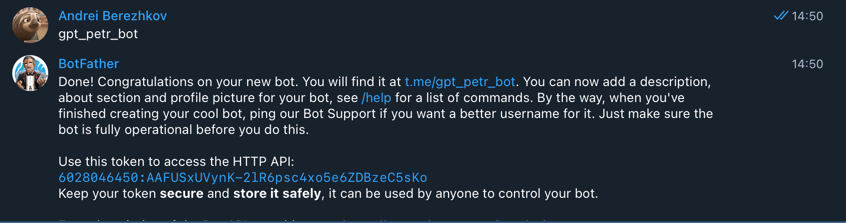

# Создание бота

## 1. Найти бота для создания ботов

## 2. Ввести в чате команду для создания бота

## 3. Ввести название

## 4. Ввести username. Должно оканчиваться на "bot"

## 5. Скопирвоать ключ API